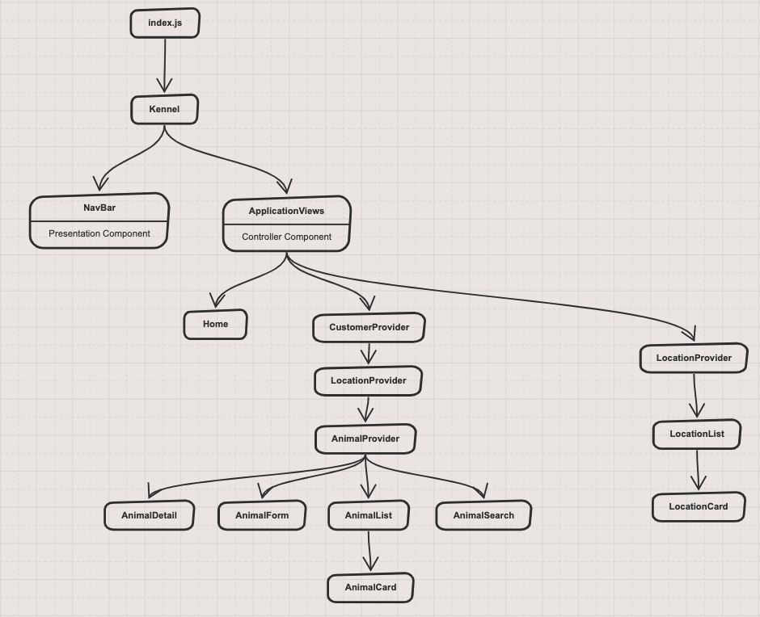

# Kennel React Application

This project was bootstrapped with [Create React App](https://github.com/facebook/create-react-app).

## Instructions

1. Clone down this repo.
1. In a terminal window, `cd kennels`.
2. Install dependencies: `npm install`.
3. Run your server: `npm start`.
4. Make sure to create a local `json` file and run [json-server](https://github.com/typicode/json-server) at port `8088`. 
## Entity Relationship Diagram

[Kennel ERD on dbdiagram]()

## Components Diagram

